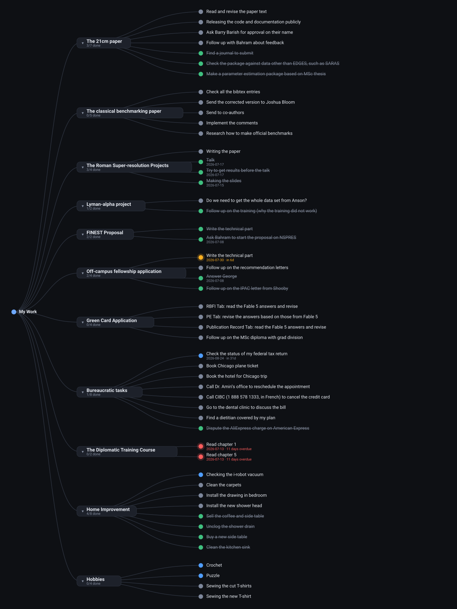

# TaskBranch

A desktop task manager that shows your work as a tree instead of a list. Projects are the big branches, tasks are the small ones growing off them. Colour tells you status at a glance, and anything with a due date creeping up gets a glow.

Built because Notion is excellent at storing tasks and bad at letting you *see* them.



*Grey = not started, blue = in progress, green = done, amber = due within a week, red = overdue. Rendered from the real layout code.*

## Features

- **Visual task tree** — Drag to pan, scroll to zoom, ⌘0 to fit everything. Click a project's chevron to fold its branch away.
- **Manual editing** — Click any node to rename it, change status, set/clear due dates, or move tasks between projects.
- **AI-powered chat** — Describe changes in plain language and let Claude or OpenAI edit your tree. "Mark the dental clinic task done", "add a Thesis Defense project with three tasks", "push everything in Bureaucratic to next month".
- **Query the AI** — Ask "what's overdue?" and get answers without touching anything.
- **One undo button** — Manual edits and AI edits both go through the same operation engine. ⌘Z undoes either.
- **Local-first** — Everything lives in a single JSON file. No cloud, no sync issues.

## Install

**Grab the `.dmg` from [Releases](../../releases)**
- `arm64` for Apple Silicon (M1/M2/M3)
- `x64` for Intel Mac

The builds are not code-signed (signing requires a $99/yr Apple Developer account), so Gatekeeper will complain on first launch. Right-click the app → **Open** → **Open**, or:

```bash
xattr -dr com.apple.quarantine /Applications/TaskBranch.app
```

## Run from source

```bash
git clone https://github.com/aryana-haghjoo/taskbranch.git
cd taskbranch
npm install
npm start
```

## Build your own .dmg

```bash
npm run dist
```

Output lands in `dist/`. Push a `v*` tag to trigger automated builds on GitHub Actions.

## Connecting an AI provider

Open **Settings** (⌘,), pick Anthropic or OpenAI, and paste an API key. Keys are encrypted with Electron's `safeStorage` (backed by the macOS Keychain) and stored in the app's support folder — never in the repo, never sent anywhere except the provider you chose. The model field is optional; defaults to `claude-sonnet-4-5` or `gpt-4o`.

Requests are made from Electron's main process, so the renderer never holds your key.

## Your data

Everything lives at `~/Library/Application Support/TaskBranch/taskbranch-data.json`. **File → Reveal Data File** opens it in Finder. Import and export are under the File menu for easy backup and migration.

The app ships with a seed tree in `src/seed.json`. Replace it with your own before building if you're forking this.

## Data shape

```json
{
  "version": 1,
  "projects": [
    {
      "id": "p_example",
      "name": "Project name",
      "tasks": [
        { "id": "t_1", "name": "Task name", "status": "Not started", "due": "2026-08-24" }
      ]
    }
  ]
}
```

- `status` is one of `Not started`, `In progress`, `Done`
- `due` is `YYYY-MM-DD` or an empty string

## Architecture

```
electron/main.js      — window, file persistence, AI proxy, native menu
electron/preload.js   — the narrow bridge exposed to the renderer
src/tree.js           — tidy-tree layout + SVG renderer (no dependencies)
src/app.js            — state, manual editing, the shared op engine
src/ai.js             — chat panel, settings modal, prompt + response parsing
src/seed.json         — starting data
```

No frontend framework and no charting library — the layout is about eighty lines of recursion and the rendering is plain SVG. Electron is the only runtime dependency.

## Future ideas

- Two-way Notion sync
- Calendar band along the tree
- Task dependencies as cross-links
- Per-project colour themes
- Focus mode on a single branch

## License

MIT

---

Built by [Aryana Haghjoo](https://github.com/aryana-haghjoo)
